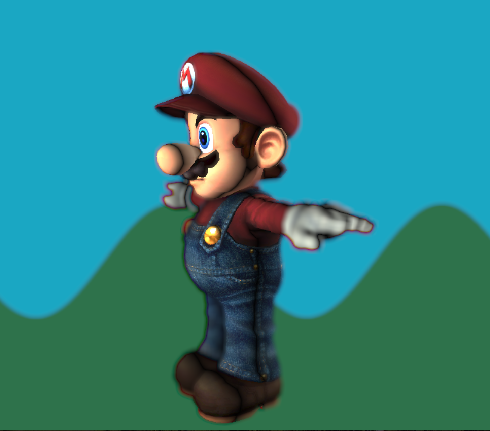

# Project 7: Deferred Renderer
### Wenli Zhao
### wenliz
#### Results

[demo](https://wpchop.github.io/homework-7-deferred-renderer-wpchop/)

I implemented reinhard tone-mapping.

My procedural background is a really simple, 2D hilly landscape generated based on the screen position and a sin function so Wahoo can frolic in the fields.

I also implemented bloom, approximated depth of field, and oil painting artistic effect using a kuwahara filter.

For extra credit, I implemented gui functionality that allows you to select the post-process filters you want to apply.

### No filters

### With Bloom

### Depth of Field

### Oil Paint

#### References
- https://en.wikipedia.org/wiki/Kuwahara_filter
- https://stackoverflow.com/questions/5830139/how-can-i-do-these-image-processing-tasks-using-opengl-es-2-0-shaders
- https://www.shadertoy.com/view/lls3WM
- https://learnopengl.com/Advanced-Lighting/Bloom
- https://www.shadertoy.com/view/XdfGDH

